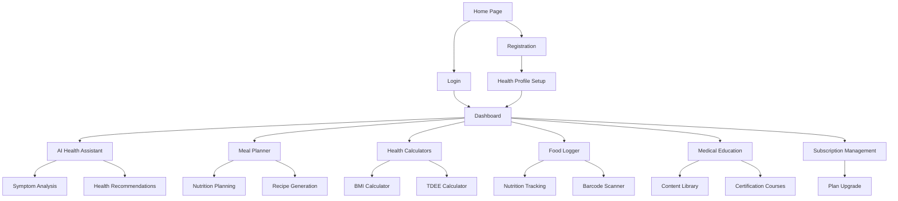

# VitaPulse - AI-Powered Health & Wellness Platform
## Product Requirements Document

## 1. Product Overview

VitaPulse is a comprehensive AI-powered health and wellness platform designed to provide advanced, culturally-sensitive health tools and services across multiple languages and user segments, ranging from individual users to healthcare professionals. The platform delivers personalized, accurate, and culturally-aware health insights while maintaining the highest standards of performance, security, and user experience.

The platform addresses the critical need for accessible, intelligent health guidance that respects cultural and religious considerations, particularly offering Halal-compliant health recommendations and multi-language support to serve diverse global communities.

## 2. Core Features

### 2.1 User Roles

| Role | Registration Method | Core Permissions |
|------|---------------------|------------------|
| Free User | Email/Google registration | Basic health calculators, limited AI consultations (5/month), basic meal planning |
| Premium User | Subscription upgrade | Unlimited AI consultations, advanced meal planning, health tracking, priority support |
| Professional User | Professional verification | All premium features, patient management tools, clinical insights, advanced analytics |
| Healthcare Provider | Medical license verification | Full platform access, patient collaboration tools, medical-grade reporting |

### 2.2 Feature Module

Our VitaPulse platform consists of the following main pages:

1. **Home Page**: Hero section with AI health assistant, feature highlights, testimonials, subscription tiers
2. **AI Health Assistant**: Symptom checker, health recommendations, cultural considerations, emergency guidance
3. **Meal Planner**: Personalized nutrition planning, dietary restrictions, cultural preferences, shopping lists
4. **Health Calculators**: BMI, TDEE, body fat percentage, heart rate zones, pregnancy calculators
5. **Health Tracking Dashboard**: Vital signs monitoring, progress tracking, health goals, analytics
6. **Food Logger**: Nutrition tracking, barcode scanning, meal analysis, dietary insights
7. **Medical Education Hub**: Health articles, video content, professional resources, certification courses
8. **User Profile**: Personal health data, preferences, subscription management, privacy settings
9. **Authentication Pages**: Login, registration, password recovery, email verification
10. **Subscription Management**: Plan comparison, billing, payment processing, upgrade/downgrade

### 2.3 Page Details

| Page Name | Module Name | Feature Description |
|-----------|-------------|---------------------|
| Home Page | Hero Section | AI-powered health assistant introduction, interactive demo, value proposition |
| Home Page | Features Showcase | Core platform capabilities, AI technology highlights, user testimonials |
| Home Page | Subscription Tiers | Free, Premium, Professional plans with feature comparison |
| AI Health Assistant | Symptom Checker | Multi-step symptom analysis, severity assessment, cultural health considerations |
| AI Health Assistant | Health Recommendations | Personalized advice, Halal-compliant suggestions, emergency protocols |
| AI Health Assistant | Cultural Sensitivity | Religious dietary laws, cultural health practices, localized medical advice |
| Meal Planner | Nutrition Planning | Calorie calculation, macro distribution, meal scheduling, dietary restrictions |
| Meal Planner | Recipe Generation | AI-powered recipe suggestions, ingredient substitutions, cooking instructions |
| Meal Planner | Shopping Lists | Automated grocery lists, nutritional optimization, budget considerations |
| Health Calculators | BMI Calculator | Body mass index calculation, health category classification, improvement suggestions |
| Health Calculators | TDEE Calculator | Total daily energy expenditure, activity level assessment, calorie recommendations |
| Health Calculators | Specialized Tools | Pregnancy calculators, heart rate zones, body fat percentage, hydration needs |
| Health Dashboard | Vital Monitoring | Blood pressure, heart rate, weight tracking, trend analysis |
| Health Dashboard | Progress Tracking | Goal setting, milestone achievements, visual progress charts |
| Health Dashboard | Health Analytics | Comprehensive health insights, risk assessments, improvement recommendations |
| Food Logger | Nutrition Tracking | Calorie counting, macro tracking, meal logging, nutritional analysis |
| Food Logger | Barcode Scanner | Product identification, nutritional data retrieval, portion size calculation |
| Food Logger | Meal Analysis | Nutritional completeness, dietary gap identification, improvement suggestions |
| Medical Education | Content Library | Health articles, medical videos, interactive learning modules |
| Medical Education | Professional Resources | Clinical guidelines, research papers, continuing education credits |
| Medical Education | Certification Courses | Accredited health education, skill assessments, professional development |
| User Profile | Health Data Management | Personal information, medical history, health preferences, data export |
| User Profile | Privacy Controls | Data sharing preferences, consent management, account deletion |
| User Profile | Subscription Management | Plan details, billing history, payment methods, plan modifications |
| Authentication | Login/Registration | Secure authentication, multi-factor authentication, social login integration |
| Authentication | Password Management | Password reset, security questions, account recovery |
| Subscription | Plan Comparison | Feature matrix, pricing tiers, upgrade incentives, trial periods |
| Subscription | Payment Processing | Secure billing, multiple payment methods, subscription lifecycle management |

## 3. Core Process

### User Journey Flow

**New User Registration Flow:**
1. User visits homepage and explores AI health assistant demo
2. User registers with email/Google authentication
3. User completes health profile setup (age, gender, health goals, dietary preferences)
4. User receives personalized dashboard with recommended features
5. User explores free features (basic calculators, limited AI consultations)
6. User considers premium upgrade for advanced features

**AI Health Consultation Flow:**
1. User accesses AI Health Assistant from dashboard
2. User inputs symptoms through guided questionnaire
3. AI analyzes symptoms considering cultural and personal factors
4. System provides severity assessment and recommendations
5. User receives culturally-appropriate health advice
6. System suggests follow-up actions or professional consultation

**Meal Planning Flow:**
1. User sets dietary preferences and restrictions
2. User inputs health goals and caloric requirements
3. AI generates personalized meal plan with cultural considerations
4. User reviews and customizes meal suggestions
5. System generates shopping list and nutritional breakdown
6. User tracks meal consumption and receives feedback



## 4. User Interface Design

### 4.1 Design Style

**Color Palette:**
- Primary: #2563EB (Medical Blue)
- Secondary: #10B981 (Health Green)
- Accent: #F59E0B (Energy Orange)
- Background: #F8FAFC (Clean White)
- Text: #1E293B (Professional Dark)
- Error: #EF4444 (Alert Red)
- Success: #22C55E (Confirmation Green)

**Typography:**
- Primary Font: Inter (Modern, readable)
- Heading Font: Poppins (Professional, friendly)
- Body Text: 16px, Line Height: 1.6
- Headings: 24px-48px with proper hierarchy

**Design Elements:**
- Button Style: Rounded corners (8px), subtle shadows, hover animations
- Layout: Card-based design with clean spacing
- Navigation: Top navigation with breadcrumbs
- Icons: Lucide React icons for consistency
- Animations: Smooth transitions, loading states, micro-interactions

### 4.2 Page Design Overview

| Page Name | Module Name | UI Elements |
|-----------|-------------|-------------|
| Home Page | Hero Section | Gradient background, animated AI assistant icon, call-to-action buttons, responsive layout |
| Home Page | Features Grid | Card-based layout, hover effects, feature icons, benefit descriptions |
| AI Assistant | Symptom Checker | Step-by-step wizard, progress indicator, symptom selection interface, severity visualization |
| AI Assistant | Results Display | Color-coded severity levels, recommendation cards, cultural consideration badges |
| Meal Planner | Planning Interface | Calendar view, drag-and-drop meal scheduling, nutritional progress bars |
| Meal Planner | Recipe Cards | Image thumbnails, difficulty ratings, cooking time, ingredient lists |
| Health Dashboard | Analytics Charts | Interactive graphs, trend lines, goal progress indicators, health score visualization |
| Health Dashboard | Quick Actions | Widget-based layout, one-click access to common features, personalized shortcuts |
| Food Logger | Logging Interface | Search autocomplete, barcode scanner integration, portion size selectors |
| Food Logger | Nutrition Display | Circular progress charts, macro breakdowns, daily/weekly summaries |
| Medical Education | Content Grid | Video thumbnails, article previews, progress tracking, bookmark functionality |
| User Profile | Settings Panel | Tabbed interface, form validation, privacy toggles, data export options |

### 4.3 Responsiveness

The platform is designed with a mobile-first approach, ensuring optimal experience across all devices:
- **Mobile (320px-768px)**: Touch-optimized interface, collapsible navigation, swipe gestures
- **Tablet (768px-1024px)**: Adaptive layout, touch and mouse support, optimized spacing
- **Desktop (1024px+)**: Full feature access, keyboard shortcuts, multi-column layouts
- **Accessibility**: WCAG 2.1 AA compliance, screen reader support, keyboard navigation

## 5. Multi-Language Support

### 5.1 Supported Languages

1. **English** (Primary)
2. **Spanish** (Español)
3. **French** (Français)
4. **German** (Deutsch)
5. **Arabic** (العربية) - RTL support
6. **Japanese** (日本語)
7. **Mandarin Chinese** (中文)
8. **Hindi** (हिन्दी)

### 5.2 Localization Features

- **Cultural Health Practices**: Localized health advice respecting cultural norms
- **Dietary Considerations**: Halal, Kosher, vegetarian, regional dietary preferences
- **Medical Terminology**: Culturally appropriate medical language
- **Date/Time Formats**: Regional formatting standards
- **Currency Support**: Local payment methods and currencies
- **Legal Compliance**: GDPR, HIPAA, regional data protection laws

## 6. AI Integration Specifications

### 6.1 AI Symptom Checker

**Input Schema:**
```json
{
  "symptoms": ["headache", "fever", "fatigue"],
  "duration": "2 days",
  "severity": "moderate",
  "user_profile": {
    "age": 35,
    "gender": "female",
    "cultural_background": "muslim",
    "medical_history": ["diabetes"]
  }
}
```

**Output Schema:**
```json
{
  "severity": "moderate",
  "confidence_score": 0.85,
  "recommendations": [
    "Rest and hydration",
    "Monitor symptoms for 48 hours",
    "Consult healthcare provider if symptoms persist"
  ],
  "cultural_considerations": "Halal-compliant health advice",
  "warning_signs": ["Persistent fever", "Difficulty breathing"],
  "emergency_indicators": false,
  "follow_up_timeline": "24-48 hours"
}
```

### 6.2 AI Meal Planner

**Input Schema:**
```json
{
  "user_goals": "weight_loss",
  "calorie_target": 1800,
  "dietary_restrictions": ["halal", "no_pork"],
  "allergies": ["nuts"],
  "cultural_preferences": "middle_eastern",
  "meal_frequency": 3
}
```

**Output Schema:**
```json
{
  "meal_plan": {
    "day": 1,
    "total_calories": 1800,
    "meals": {
      "breakfast": {
        "name": "Mediterranean Breakfast Bowl",
        "calories": 450,
        "ingredients": [...],
        "preparation_time": "15 minutes",
        "cultural_compliance": "halal_certified"
      },
      "lunch": {...},
      "dinner": {...},
      "snacks": [...]
    },
    "nutritional_breakdown": {
      "protein": "25%",
      "carbs": "50%",
      "fat": "25%",
      "fiber": "35g",
      "sodium": "2000mg"
    },
    "cultural_notes": "All meals comply with Halal dietary requirements"
  }
}
```

## 7. Performance Requirements

### 7.1 Performance Metrics

- **Page Load Time**: < 2 seconds for initial load
- **AI Response Time**: < 3 seconds for symptom analysis
- **Database Queries**: < 100ms average response time
- **Image Loading**: Progressive loading with WebP optimization
- **Mobile Performance**: Lighthouse score > 90
- **Uptime**: 99.9% availability SLA

### 7.2 Optimization Strategies

- **Caching**: Redis for session data, CDN for static assets
- **Database**: Query optimization, connection pooling, read replicas
- **Frontend**: Code splitting, lazy loading, service workers
- **Images**: WebP format, responsive images, compression
- **API**: Rate limiting, response compression, efficient serialization

## 8. Security & Compliance

### 8.1 Security Measures

- **Authentication**: Multi-factor authentication, OAuth integration
- **Data Encryption**: AES-256 encryption at rest, TLS 1.3 in transit
- **Access Control**: Role-based permissions, row-level security
- **API Security**: Rate limiting, input validation, CORS policies
- **Monitoring**: Real-time threat detection, audit logging

### 8.2 Compliance Standards

- **GDPR**: EU data protection compliance
- **HIPAA**: Healthcare data protection (US)
- **SOC 2**: Security and availability controls
- **ISO 27001**: Information security management
- **Medical Device Regulations**: FDA guidelines for health apps

## 9. Subscription Model

### 9.1 Pricing Tiers

**Free Tier:**
- 5 AI consultations per month
- Basic health calculators
- Limited meal planning
- Community support

**Premium Tier ($19.99/month):**
- Unlimited AI consultations
- Advanced meal planning
- Health tracking and analytics
- Priority support
- Export health data

**Professional Tier ($49.99/month):**
- All Premium features
- Patient management tools
- Clinical insights and reporting
- API access
- White-label options

### 9.2 Gamification Features

- **Health Score**: Comprehensive wellness rating
- **Achievement Badges**: Milestone rewards
- **Streak Tracking**: Daily habit maintenance
- **Leaderboards**: Community challenges
- **Progress Visualization**: Goal achievement tracking

## 10. Technical Implementation Notes

### 10.1 Development Priorities

1. **Phase 1**: Core authentication and user management
2. **Phase 2**: AI health assistant and symptom checker
3. **Phase 3**: Meal planning and nutrition tracking
4. **Phase 4**: Health calculators and dashboard
5. **Phase 5**: Medical education and professional features
6. **Phase 6**: Advanced analytics and reporting

### 10.2 Quality Assurance

- **Testing Strategy**: Unit tests, integration tests, E2E testing
- **Code Quality**: ESLint, Prettier, TypeScript strict mode
- **Performance Monitoring**: Real user monitoring, error tracking
- **Security Audits**: Regular penetration testing, vulnerability scans
- **Accessibility Testing**: Screen reader compatibility, keyboard navigation

This comprehensive product requirements document serves as the foundation for building a world-class AI-powered health platform that prioritizes user experience, cultural sensitivity, and technical excellence.