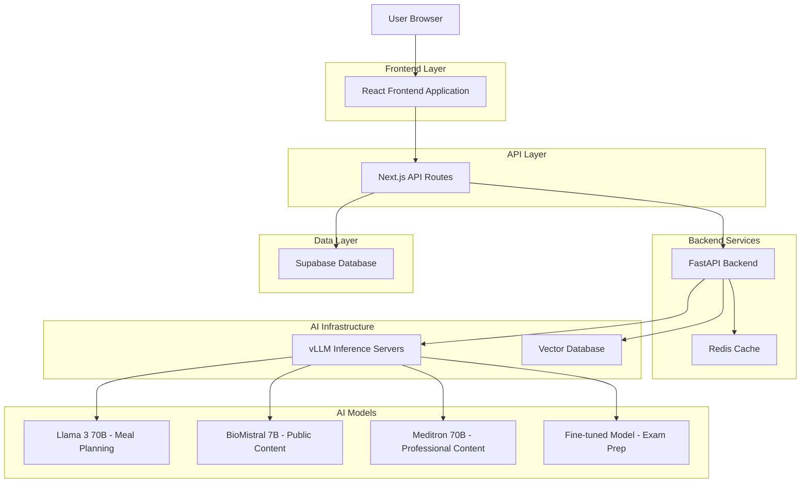
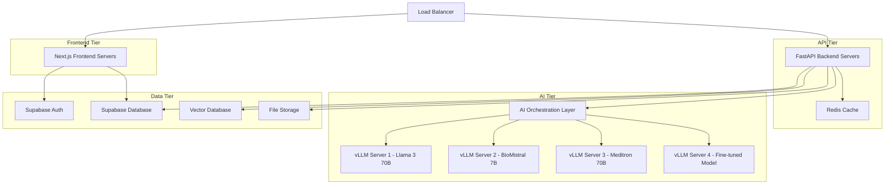
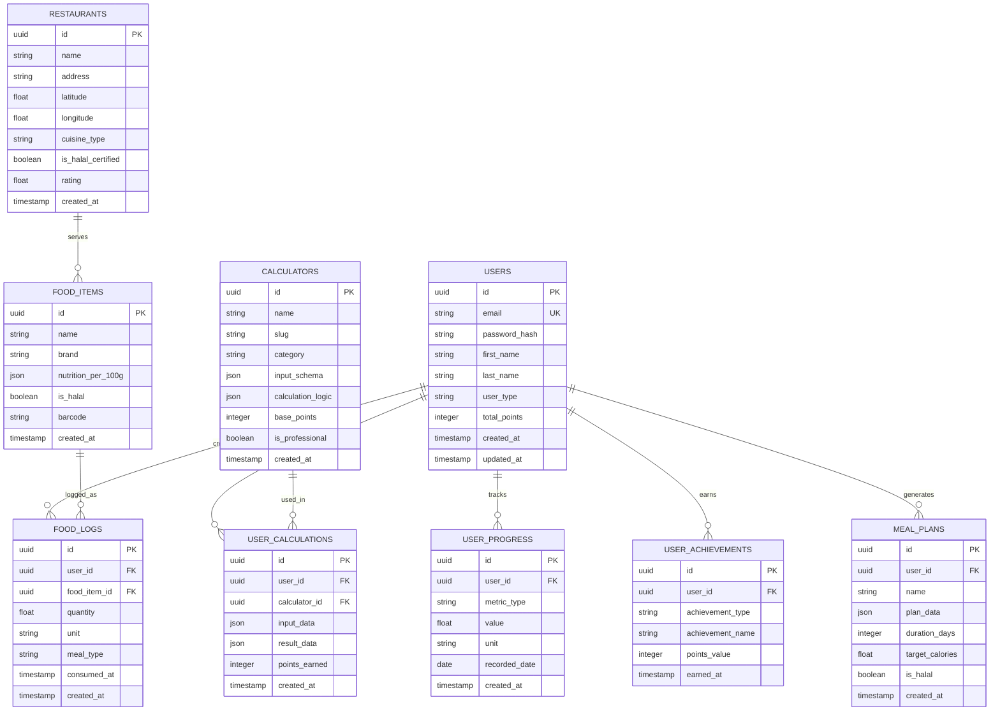

# VitaPulse Technical Architecture Document

## 1. Architecture Design



## 2. Technology Description

- **Frontend**: React@18 + Next.js@14 + TypeScript + Tailwind CSS + Framer Motion
- **Backend**: FastAPI + Python 3.11 + vLLM + Redis
- **Database**: Supabase (PostgreSQL) + ChromaDB/Weaviate (Vector DB)
- **AI Infrastructure**: vLLM inference servers + Custom orchestration layer
- **Authentication**: Supabase Auth
- **Deployment**: Docker + Kubernetes + Cloud GPUs (A100/L40s)

## 3. Route Definitions

| Route | Purpose |
|-------|----------|
| / | Homepage with hero section and feature overview |
| /auth/signin | User authentication and login |
| /auth/signup | User registration and account creation |
| /dashboard | Main user dashboard with health overview and quick stats |
| /health-calculators | Calculator hub with all 20 health calculators |
| /calculators/bmi | BMI calculator with health insights |
| /calculators/tdee | Total Daily Energy Expenditure calculator |
| /calculators/calorie-needs | Daily calorie requirements calculator |
| /calculators/hydration | Daily water intake calculator |
| /calculators/sleep-needs | Optimal sleep duration calculator |
| /calculators/macro-splitter | Macronutrient distribution calculator |
| /calculators/heart-rate-zone | Target heart rate zones calculator |
| /calculators/body-fat | Body fat percentage calculator |
| /calculators/step-goal | Daily step targets calculator |
| /calculators/stress-estimator | Stress level assessment tool |
| /calculators/fitness-progress | Fitness progress tracking |
| /pro-calculators/gfr | GFR (Glomerular Filtration Rate) calculator |
| /pro-calculators/cvd-risk | Cardiovascular disease risk calculator |
| /pro-calculators/drug-dosage | Medication dosing calculator |
| /pro-calculators/bmr | Basal Metabolic Rate calculator |
| /pro-calculators/bp-risk | Blood pressure risk assessment |
| /pro-calculators/cholesterol | Cholesterol risk calculator |
| /pro-calculators/diabetes-risk | Type 2 diabetes screening |
| /pro-calculators/pregnancy | Pregnancy-related calculations |
| /pro-calculators/pediatric-growth | Child development metrics |
| /pro-calculators/nutrition-assessment | Professional dietary analysis |
| /meal-planner | AI-powered meal planning with Halal options |
| /food-logger | Halal food logging with restaurant database |
| /analytics | User progress analytics and health insights |
| /achievements | Gamification system with badges and streaks |
| /community | Social features and health challenges |
| /workouts | Exercise tracking and workout plans |
| /meded/qbank | AI-generated medical question bank |
| /meded/flashcards | AI-powered flashcard system |
| /meded/cases | Clinical case simulator |
| /meded/study-planner | AI study planner for medical students |

## 4. API Definitions

### 4.1 Authentication APIs

**User Registration**
```
POST /api/auth/register
```

Request:
| Param Name | Param Type | isRequired | Description |
|------------|------------|------------|-------------|
| email | string | true | User email address |
| password | string | true | User password (min 8 characters) |
| firstName | string | true | User's first name |
| lastName | string | true | User's last name |
| userType | string | true | 'public', 'professional', or 'student' |

Response:
| Param Name | Param Type | Description |
|------------|------------|-------------|
| success | boolean | Registration status |
| user | object | User profile data |
| token | string | JWT authentication token |

**User Login**
```
POST /api/auth/login
```

Request:
| Param Name | Param Type | isRequired | Description |
|------------|------------|------------|-------------|
| email | string | true | User email address |
| password | string | true | User password |

Response:
| Param Name | Param Type | Description |
|------------|------------|-------------|
| success | boolean | Login status |
| user | object | User profile data |
| token | string | JWT authentication token |

### 4.2 Calculator APIs

**BMI Calculation**
```
POST /api/calculators/bmi
```

Request:
| Param Name | Param Type | isRequired | Description |
|------------|------------|------------|-------------|
| weight | number | true | Weight in kilograms |
| height | number | true | Height in centimeters |
| userId | string | true | User identifier |

Response:
| Param Name | Param Type | Description |
|------------|------------|-------------|
| bmi | number | Calculated BMI value |
| category | string | BMI category (underweight, normal, overweight, obese) |
| interpretation | string | Health interpretation and recommendations |
| pointsEarned | number | Gamification points awarded |

**TDEE Calculation**
```
POST /api/calculators/tdee
```

Request:
| Param Name | Param Type | isRequired | Description |
|------------|------------|------------|-------------|
| weight | number | true | Weight in kilograms |
| height | number | true | Height in centimeters |
| age | number | true | Age in years |
| gender | string | true | 'male' or 'female' |
| activityLevel | string | true | Activity level (sedentary, light, moderate, active, very_active) |
| userId | string | true | User identifier |

Response:
| Param Name | Param Type | Description |
|------------|------------|-------------|
| bmr | number | Basal Metabolic Rate |
| tdee | number | Total Daily Energy Expenditure |
| calorieGoals | object | Calorie goals for weight loss/gain/maintenance |
| interpretation | string | Personalized recommendations |
| pointsEarned | number | Gamification points awarded |

### 4.3 AI Meal Planning APIs

**Generate Meal Plan**
```
POST /api/ai/meal-plan
```

Request:
| Param Name | Param Type | isRequired | Description |
|------------|------------|------------|-------------|
| userId | string | true | User identifier |
| calorieTarget | number | true | Daily calorie target |
| dietaryRestrictions | array | false | List of dietary restrictions |
| isHalal | boolean | false | Halal food requirement |
| budget | number | false | Daily food budget |
| mealCount | number | false | Number of meals per day (default: 3) |
| duration | number | false | Plan duration in days (default: 7) |

Response:
| Param Name | Param Type | Description |
|------------|------------|-------------|
| mealPlan | object | Complete meal plan with recipes |
| nutritionSummary | object | Daily nutrition breakdown |
| shoppingList | array | Grocery shopping list |
| estimatedCost | number | Total estimated cost |
| aiInsights | string | AI-generated health insights |

### 4.4 Food Logging APIs

**Log Food Item**
```
POST /api/food/log
```

Request:
| Param Name | Param Type | isRequired | Description |
|------------|------------|------------|-------------|
| userId | string | true | User identifier |
| foodId | string | true | Food item identifier |
| quantity | number | true | Quantity consumed |
| unit | string | true | Unit of measurement |
| mealType | string | true | breakfast, lunch, dinner, snack |
| timestamp | string | true | ISO timestamp of consumption |

Response:
| Param Name | Param Type | Description |
|------------|------------|-------------|
| logId | string | Food log entry identifier |
| nutrition | object | Nutritional information |
| dailyProgress | object | Progress toward daily goals |
| pointsEarned | number | Gamification points awarded |

**Search Halal Restaurants**
```
GET /api/restaurants/search
```

Request:
| Param Name | Param Type | isRequired | Description |
|------------|------------|------------|-------------|
| latitude | number | true | User's latitude |
| longitude | number | true | User's longitude |
| radius | number | false | Search radius in kilometers (default: 10) |
| cuisine | string | false | Cuisine type filter |

Response:
| Param Name | Param Type | Description |
|------------|------------|-------------|
| restaurants | array | List of nearby Halal restaurants |
| totalCount | number | Total number of results |
| averageRating | number | Average rating of results |

### 4.5 Medical Education APIs

**Generate MCQ Questions**
```
POST /api/meded/generate-questions
```

Request:
| Param Name | Param Type | isRequired | Description |
|------------|------------|------------|-------------|
| userId | string | true | User identifier |
| topic | string | true | Medical topic or specialty |
| difficulty | string | true | easy, medium, hard |
| questionCount | number | true | Number of questions to generate |
| examType | string | false | USMLE, MCAT, NCLEX, etc. |

Response:
| Param Name | Param Type | Description |
|------------|------------|-------------|
| questions | array | Generated MCQ questions with explanations |
| sessionId | string | Study session identifier |
| estimatedTime | number | Estimated completion time in minutes |

## 5. Server Architecture Diagram



## 6. Data Model

### 6.1 Data Model Definition



### 6.2 Data Definition Language

**Users Table**
```sql
-- Create users table
CREATE TABLE users (
    id UUID PRIMARY KEY DEFAULT gen_random_uuid(),
    email VARCHAR(255) UNIQUE NOT NULL,
    password_hash VARCHAR(255) NOT NULL,
    first_name VARCHAR(100) NOT NULL,
    last_name VARCHAR(100) NOT NULL,
    user_type VARCHAR(20) DEFAULT 'public' CHECK (user_type IN ('public', 'professional', 'student')),
    total_points INTEGER DEFAULT 0,
    created_at TIMESTAMP WITH TIME ZONE DEFAULT NOW(),
    updated_at TIMESTAMP WITH TIME ZONE DEFAULT NOW()
);

-- Create indexes
CREATE INDEX idx_users_email ON users(email);
CREATE INDEX idx_users_user_type ON users(user_type);
CREATE INDEX idx_users_total_points ON users(total_points DESC);
```

**Calculators Table**
```sql
-- Create calculators table
CREATE TABLE calculators (
    id UUID PRIMARY KEY DEFAULT gen_random_uuid(),
    name VARCHAR(255) NOT NULL,
    slug VARCHAR(100) UNIQUE NOT NULL,
    category VARCHAR(50) NOT NULL,
    input_schema JSONB NOT NULL,
    calculation_logic JSONB NOT NULL,
    base_points INTEGER DEFAULT 10,
    is_professional BOOLEAN DEFAULT FALSE,
    created_at TIMESTAMP WITH TIME ZONE DEFAULT NOW()
);

-- Create indexes
CREATE INDEX idx_calculators_slug ON calculators(slug);
CREATE INDEX idx_calculators_category ON calculators(category);
CREATE INDEX idx_calculators_is_professional ON calculators(is_professional);

-- Insert initial calculator data
INSERT INTO calculators (name, slug, category, input_schema, calculation_logic, base_points, is_professional) VALUES
('BMI Calculator', 'bmi', 'basic', '{"weight": "number", "height": "number"}', '{"formula": "weight / (height/100)^2"}', 10, FALSE),
('TDEE Calculator', 'tdee', 'basic', '{"weight": "number", "height": "number", "age": "number", "gender": "string", "activity": "string"}', '{"bmr_formula": "mifflin_st_jeor", "activity_multipliers": {"sedentary": 1.2, "light": 1.375, "moderate": 1.55, "active": 1.725, "very_active": 1.9}}', 15, FALSE),
('GFR Calculator', 'gfr', 'professional', '{"creatinine": "number", "age": "number", "gender": "string", "race": "string"}', '{"formula": "ckd_epi"}', 25, TRUE);
```

**User Calculations Table**
```sql
-- Create user_calculations table
CREATE TABLE user_calculations (
    id UUID PRIMARY KEY DEFAULT gen_random_uuid(),
    user_id UUID NOT NULL REFERENCES users(id) ON DELETE CASCADE,
    calculator_id UUID NOT NULL REFERENCES calculators(id),
    input_data JSONB NOT NULL,
    result_data JSONB NOT NULL,
    points_earned INTEGER DEFAULT 0,
    created_at TIMESTAMP WITH TIME ZONE DEFAULT NOW()
);

-- Create indexes
CREATE INDEX idx_user_calculations_user_id ON user_calculations(user_id);
CREATE INDEX idx_user_calculations_calculator_id ON user_calculations(calculator_id);
CREATE INDEX idx_user_calculations_created_at ON user_calculations(created_at DESC);
```

**Food Items Table**
```sql
-- Create food_items table
CREATE TABLE food_items (
    id UUID PRIMARY KEY DEFAULT gen_random_uuid(),
    name VARCHAR(255) NOT NULL,
    brand VARCHAR(255),
    nutrition_per_100g JSONB NOT NULL,
    is_halal BOOLEAN DEFAULT FALSE,
    barcode VARCHAR(50),
    created_at TIMESTAMP WITH TIME ZONE DEFAULT NOW()
);

-- Create indexes
CREATE INDEX idx_food_items_name ON food_items USING GIN (to_tsvector('english', name));
CREATE INDEX idx_food_items_is_halal ON food_items(is_halal);
CREATE INDEX idx_food_items_barcode ON food_items(barcode);

-- Insert sample Halal food data
INSERT INTO food_items (name, brand, nutrition_per_100g, is_halal) VALUES
('Halal Chicken Breast', 'Generic', '{"calories": 165, "protein": 31, "carbs": 0, "fat": 3.6}', TRUE),
('Basmati Rice', 'Generic', '{"calories": 130, "protein": 2.7, "carbs": 28, "fat": 0.3}', TRUE),
('Olive Oil', 'Generic', '{"calories": 884, "protein": 0, "carbs": 0, "fat": 100}', TRUE);
```

**Restaurants Table**
```sql
-- Create restaurants table
CREATE TABLE restaurants (
    id UUID PRIMARY KEY DEFAULT gen_random_uuid(),
    name VARCHAR(255) NOT NULL,
    address TEXT NOT NULL,
    latitude DECIMAL(10, 8) NOT NULL,
    longitude DECIMAL(11, 8) NOT NULL,
    cuisine_type VARCHAR(100),
    is_halal_certified BOOLEAN DEFAULT TRUE,
    rating DECIMAL(3, 2) DEFAULT 0.0,
    created_at TIMESTAMP WITH TIME ZONE DEFAULT NOW()
);

-- Create spatial index for location-based queries
CREATE INDEX idx_restaurants_location ON restaurants USING GIST (ll_to_earth(latitude, longitude));
CREATE INDEX idx_restaurants_is_halal ON restaurants(is_halal_certified);
CREATE INDEX idx_restaurants_rating ON restaurants(rating DESC);

-- Insert sample Halal restaurant data
INSERT INTO restaurants (name, address, latitude, longitude, cuisine_type, is_halal_certified, rating) VALUES
('Halal Guys', '123 Main St, New York, NY', 40.7128, -74.0060, 'Middle Eastern', TRUE, 4.5),
('Bismillah Restaurant', '456 Oak Ave, Los Angeles, CA', 34.0522, -118.2437, 'Pakistani', TRUE, 4.2),
('Masjid Al-Noor Cafe', '789 Pine St, Chicago, IL', 41.8781, -87.6298, 'Mediterranean', TRUE, 4.7);
```

**Row Level Security (RLS) Policies**
```sql
-- Enable RLS on user-specific tables
ALTER TABLE user_calculations ENABLE ROW LEVEL SECURITY;
ALTER TABLE user_progress ENABLE ROW LEVEL SECURITY;
ALTER TABLE user_achievements ENABLE ROW LEVEL SECURITY;
ALTER TABLE food_logs ENABLE ROW LEVEL SECURITY;
ALTER TABLE meal_plans ENABLE ROW LEVEL SECURITY;

-- Create policies for user data access
CREATE POLICY "Users can view own calculations" ON user_calculations
    FOR SELECT USING (auth.uid() = user_id);

CREATE POLICY "Users can insert own calculations" ON user_calculations
    FOR INSERT WITH CHECK (auth.uid() = user_id);

CREATE POLICY "Users can view own progress" ON user_progress
    FOR SELECT USING (auth.uid() = user_id);

CREATE POLICY "Users can insert own progress" ON user_progress
    FOR INSERT WITH CHECK (auth.uid() = user_id);

-- Grant permissions
GRANT SELECT ON calculators TO anon;
GRANT SELECT ON food_items TO anon;
GRANT SELECT ON restaurants TO anon;
GRANT ALL PRIVILEGES ON ALL TABLES TO authenticated;
```

This technical architecture provides a comprehensive foundation for implementing the VitaPulse platform with all required features, proper scalability, and robust AI integration capabilities.