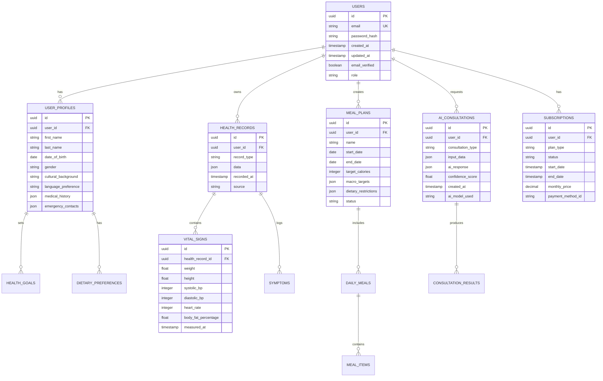

# VitaPulse - Technical Architecture Document
## Production-Ready AI Health Platform Implementation

## 1. Architecture Design


## 2. Technology Stack

### 2.1 Frontend Technologies
- **Framework**: React 18 + Next.js 14 (App Router)
- **Styling**: Tailwind CSS 3.4 + Headless UI
- **State Management**: Zustand + React Query (TanStack Query)
- **UI Components**: Radix UI + Lucide React Icons
- **Forms**: React Hook Form + Zod validation
- **Charts**: Recharts + D3.js
- **Internationalization**: next-i18next
- **PWA**: next-pwa
- **Build Tool**: Turbopack (Next.js 14)

### 2.2 Backend Infrastructure
- **Backend-as-a-Service**: Supabase (PostgreSQL + Auth + Storage + Edge Functions)
- **Database**: PostgreSQL 15 with Row Level Security
- **Authentication**: Supabase Auth with OAuth providers
- **File Storage**: Supabase Storage with CDN
- **Real-time**: Supabase Realtime subscriptions
- **Caching**: Redis Cloud + Next.js caching
- **AI Services**: OpenAI GPT-4 + Claude 3 (Anthropic)

### 2.3 DevOps & Monitoring
- **Deployment**: Vercel (Frontend) + Supabase (Backend)
- **Monitoring**: Sentry + Vercel Analytics
- **Performance**: Lighthouse CI + Web Vitals
- **Security**: Supabase Security + OWASP compliance
- **Testing**: Jest + Playwright + Cypress

## 3. Route Definitions

| Route | Purpose | Authentication Required |
|-------|---------|------------------------|
| / | Home page with AI assistant demo | No |
| /auth/login | User authentication | No |
| /auth/register | User registration | No |
| /auth/callback | OAuth callback handler | No |
| /dashboard | User health dashboard | Yes |
| /ai-assistant | AI health consultation interface | Yes (Free: 5/month, Premium: Unlimited) |
| /meal-planner | Personalized nutrition planning | Yes |
| /health-calculators | BMI, TDEE, and specialized calculators | Partial (Basic: Free, Advanced: Premium) |
| /food-logger | Nutrition tracking and meal logging | Yes |
| /health-tracking | Vital signs and progress monitoring | Yes |
| /medical-education | Health content and certification courses | Partial |
| /profile | User profile and health data management | Yes |
| /subscription | Plan management and billing | Yes |
| /api/ai/symptom-checker | AI symptom analysis endpoint | Yes |
| /api/ai/meal-planner | AI meal planning endpoint | Yes |
| /api/health/calculators | Health calculation endpoints | Partial |
| /api/nutrition/search | Food database search | Yes |
| /api/user/profile | User data management | Yes |
| /api/subscription/manage | Subscription operations | Yes |

## 4. API Definitions

### 4.1 Authentication APIs

**User Registration**
```
POST /api/auth/register
```

Request:
| Param Name | Param Type | Required | Description |
|------------|------------|----------|-------------|
| email | string | true | User email address |
| password | string | true | Password (min 8 chars) |
| firstName | string | true | User's first name |
| lastName | string | true | User's last name |
| dateOfBirth | string | true | ISO date format |
| gender | string | true | male/female/other |
| culturalBackground | string | false | Cultural/religious background |

Response:
```json
{
  "success": true,
  "user": {
    "id": "uuid",
    "email": "user@example.com",
    "profile": {
      "firstName": "John",
      "lastName": "Doe"
    }
  },
  "session": {
    "access_token": "jwt_token",
    "refresh_token": "refresh_token"
  }
}
```

### 4.2 AI Health Assistant APIs

**Symptom Analysis**
```
POST /api/ai/symptom-checker
```

Request:
```json
{
  "symptoms": ["headache", "fever", "fatigue"],
  "duration": "2 days",
  "severity": "moderate",
  "additionalInfo": "Started after travel",
  "userContext": {
    "age": 35,
    "gender": "female",
    "medicalHistory": ["diabetes"],
    "culturalBackground": "muslim"
  }
}
```

Response:
```json
{
  "analysisId": "uuid",
  "severity": "moderate",
  "confidenceScore": 0.85,
  "possibleConditions": [
    {
      "condition": "Viral Upper Respiratory Infection",
      "probability": 0.7,
      "description": "Common cold or flu-like illness"
    }
  ],
  "recommendations": [
    "Rest and increase fluid intake",
    "Monitor temperature regularly",
    "Consider over-the-counter pain relief"
  ],
  "culturalConsiderations": {
    "halalMedications": true,
    "culturalPractices": ["Honey and warm water remedy"]
  },
  "warningSigns": ["High fever >101.5°F", "Difficulty breathing"],
  "emergencyIndicators": false,
  "followUpTimeline": "24-48 hours",
  "disclaimers": ["This is not a medical diagnosis", "Consult healthcare provider for persistent symptoms"]
}
```

### 4.3 Meal Planning APIs

**Generate Meal Plan**
```
POST /api/ai/meal-planner
```

Request:
```json
{
  "goals": ["weight_loss", "muscle_gain"],
  "calorieTarget": 1800,
  "macroTargets": {
    "protein": 25,
    "carbs": 50,
    "fat": 25
  },
  "dietaryRestrictions": ["halal", "no_shellfish"],
  "allergies": ["nuts", "dairy"],
  "culturalPreferences": "middle_eastern",
  "mealFrequency": 3,
  "cookingTime": "moderate",
  "budget": "medium"
}
```

Response:
```json
{
  "planId": "uuid",
  "duration": "7 days",
  "totalCalories": 1800,
  "dailyPlans": [
    {
      "day": 1,
      "date": "2024-01-15",
      "meals": {
        "breakfast": {
          "id": "meal_uuid",
          "name": "Mediterranean Breakfast Bowl",
          "calories": 450,
          "macros": {
            "protein": 20,
            "carbs": 45,
            "fat": 15
          },
          "ingredients": [
            {
              "name": "Greek yogurt (halal)",
              "amount": "1 cup",
              "calories": 130
            }
          ],
          "instructions": ["Mix yogurt with honey", "Add fresh berries"],
          "prepTime": "10 minutes",
          "culturalCompliance": "halal_certified",
          "nutritionScore": 8.5
        }
      },
      "nutritionalSummary": {
        "totalCalories": 1800,
        "protein": "25%",
        "carbs": "50%",
        "fat": "25%",
        "fiber": "35g",
        "micronutrients": {
          "vitaminC": "120% DV",
          "iron": "80% DV"
        }
      },
      "shoppingList": [
        {
          "category": "Dairy",
          "items": ["Greek yogurt (halal certified)"]
        }
      ]
    }
  ],
  "weeklyNutritionAnalysis": {
    "averageCalories": 1800,
    "macroBalance": "optimal",
    "micronutrientCoverage": 0.92,
    "culturalCompliance": 1.0
  }
}
```

### 4.4 Health Tracking APIs

**Log Health Data**
```
POST /api/health/log
```

Request:
```json
{
  "type": "vital_signs",
  "data": {
    "bloodPressure": {
      "systolic": 120,
      "diastolic": 80
    },
    "heartRate": 72,
    "weight": 70.5,
    "bodyFat": 15.2
  },
  "timestamp": "2024-01-15T10:30:00Z",
  "notes": "Measured after morning workout"
}
```

## 5. Server Architecture Diagram


## 6. Data Model

### 6.1 Database Schema



### 6.2 Data Definition Language

**Users Table**
```sql
-- Enable UUID extension
CREATE EXTENSION IF NOT EXISTS "uuid-ossp";

-- Users table
CREATE TABLE users (
    id UUID PRIMARY KEY DEFAULT uuid_generate_v4(),
    email VARCHAR(255) UNIQUE NOT NULL,
    password_hash VARCHAR(255),
    created_at TIMESTAMP WITH TIME ZONE DEFAULT NOW(),
    updated_at TIMESTAMP WITH TIME ZONE DEFAULT NOW(),
    email_verified BOOLEAN DEFAULT FALSE,
    role VARCHAR(20) DEFAULT 'user' CHECK (role IN ('user', 'premium', 'professional', 'admin')),
    last_login TIMESTAMP WITH TIME ZONE,
    is_active BOOLEAN DEFAULT TRUE
);

-- User profiles table
CREATE TABLE user_profiles (
    id UUID PRIMARY KEY DEFAULT uuid_generate_v4(),
    user_id UUID REFERENCES users(id) ON DELETE CASCADE,
    first_name VARCHAR(100) NOT NULL,
    last_name VARCHAR(100) NOT NULL,
    date_of_birth DATE,
    gender VARCHAR(20) CHECK (gender IN ('male', 'female', 'other', 'prefer_not_to_say')),
    cultural_background VARCHAR(100),
    language_preference VARCHAR(10) DEFAULT 'en',
    medical_history JSONB DEFAULT '[]',
    emergency_contacts JSONB DEFAULT '[]',
    privacy_settings JSONB DEFAULT '{}',
    created_at TIMESTAMP WITH TIME ZONE DEFAULT NOW(),
    updated_at TIMESTAMP WITH TIME ZONE DEFAULT NOW()
);

-- Health records table
CREATE TABLE health_records (
    id UUID PRIMARY KEY DEFAULT uuid_generate_v4(),
    user_id UUID REFERENCES users(id) ON DELETE CASCADE,
    record_type VARCHAR(50) NOT NULL,
    data JSONB NOT NULL,
    recorded_at TIMESTAMP WITH TIME ZONE DEFAULT NOW(),
    source VARCHAR(50) DEFAULT 'user_input',
    verified BOOLEAN DEFAULT FALSE,
    created_at TIMESTAMP WITH TIME ZONE DEFAULT NOW()
);

-- Vital signs table
CREATE TABLE vital_signs (
    id UUID PRIMARY KEY DEFAULT uuid_generate_v4(),
    user_id UUID REFERENCES users(id) ON DELETE CASCADE,
    weight DECIMAL(5,2),
    height DECIMAL(5,2),
    systolic_bp INTEGER,
    diastolic_bp INTEGER,
    heart_rate INTEGER,
    body_fat_percentage DECIMAL(4,2),
    measured_at TIMESTAMP WITH TIME ZONE DEFAULT NOW(),
    notes TEXT,
    created_at TIMESTAMP WITH TIME ZONE DEFAULT NOW()
);

-- Meal plans table
CREATE TABLE meal_plans (
    id UUID PRIMARY KEY DEFAULT uuid_generate_v4(),
    user_id UUID REFERENCES users(id) ON DELETE CASCADE,
    name VARCHAR(200) NOT NULL,
    start_date DATE NOT NULL,
    end_date DATE NOT NULL,
    target_calories INTEGER,
    macro_targets JSONB,
    dietary_restrictions JSONB DEFAULT '[]',
    cultural_preferences JSONB DEFAULT '[]',
    status VARCHAR(20) DEFAULT 'active' CHECK (status IN ('active', 'completed', 'paused')),
    ai_generated BOOLEAN DEFAULT FALSE,
    created_at TIMESTAMP WITH TIME ZONE DEFAULT NOW(),
    updated_at TIMESTAMP WITH TIME ZONE DEFAULT NOW()
);

-- Daily meals table
CREATE TABLE daily_meals (
    id UUID PRIMARY KEY DEFAULT uuid_generate_v4(),
    meal_plan_id UUID REFERENCES meal_plans(id) ON DELETE CASCADE,
    date DATE NOT NULL,
    meal_type VARCHAR(20) NOT NULL CHECK (meal_type IN ('breakfast', 'lunch', 'dinner', 'snack')),
    meal_data JSONB NOT NULL,
    calories INTEGER,
    macros JSONB,
    consumed BOOLEAN DEFAULT FALSE,
    created_at TIMESTAMP WITH TIME ZONE DEFAULT NOW()
);

-- AI consultations table
CREATE TABLE ai_consultations (
    id UUID PRIMARY KEY DEFAULT uuid_generate_v4(),
    user_id UUID REFERENCES users(id) ON DELETE CASCADE,
    consultation_type VARCHAR(50) NOT NULL,
    input_data JSONB NOT NULL,
    ai_response JSONB NOT NULL,
    confidence_score DECIMAL(3,2),
    ai_model_used VARCHAR(50),
    tokens_used INTEGER,
    processing_time_ms INTEGER,
    created_at TIMESTAMP WITH TIME ZONE DEFAULT NOW()
);

-- Subscriptions table
CREATE TABLE subscriptions (
    id UUID PRIMARY KEY DEFAULT uuid_generate_v4(),
    user_id UUID REFERENCES users(id) ON DELETE CASCADE,
    plan_type VARCHAR(20) NOT NULL CHECK (plan_type IN ('free', 'premium', 'professional')),
    status VARCHAR(20) DEFAULT 'active' CHECK (status IN ('active', 'cancelled', 'expired', 'paused')),
    start_date TIMESTAMP WITH TIME ZONE DEFAULT NOW(),
    end_date TIMESTAMP WITH TIME ZONE,
    monthly_price DECIMAL(10,2),
    payment_method_id VARCHAR(100),
    stripe_subscription_id VARCHAR(100),
    created_at TIMESTAMP WITH TIME ZONE DEFAULT NOW(),
    updated_at TIMESTAMP WITH TIME ZONE DEFAULT NOW()
);

-- Usage tracking table
CREATE TABLE usage_tracking (
    id UUID PRIMARY KEY DEFAULT uuid_generate_v4(),
    user_id UUID REFERENCES users(id) ON DELETE CASCADE,
    feature_type VARCHAR(50) NOT NULL,
    usage_count INTEGER DEFAULT 1,
    date DATE DEFAULT CURRENT_DATE,
    metadata JSONB DEFAULT '{}',
    created_at TIMESTAMP WITH TIME ZONE DEFAULT NOW()
);

-- Create indexes for performance
CREATE INDEX idx_users_email ON users(email);
CREATE INDEX idx_user_profiles_user_id ON user_profiles(user_id);
CREATE INDEX idx_health_records_user_id ON health_records(user_id);
CREATE INDEX idx_health_records_type ON health_records(record_type);
CREATE INDEX idx_vital_signs_user_id ON vital_signs(user_id);
CREATE INDEX idx_vital_signs_measured_at ON vital_signs(measured_at DESC);
CREATE INDEX idx_meal_plans_user_id ON meal_plans(user_id);
CREATE INDEX idx_daily_meals_plan_id ON daily_meals(meal_plan_id);
CREATE INDEX idx_daily_meals_date ON daily_meals(date);
CREATE INDEX idx_ai_consultations_user_id ON ai_consultations(user_id);
CREATE INDEX idx_ai_consultations_type ON ai_consultations(consultation_type);
CREATE INDEX idx_subscriptions_user_id ON subscriptions(user_id);
CREATE INDEX idx_usage_tracking_user_date ON usage_tracking(user_id, date);

-- Row Level Security (RLS) policies
ALTER TABLE users ENABLE ROW LEVEL SECURITY;
ALTER TABLE user_profiles ENABLE ROW LEVEL SECURITY;
ALTER TABLE health_records ENABLE ROW LEVEL SECURITY;
ALTER TABLE vital_signs ENABLE ROW LEVEL SECURITY;
ALTER TABLE meal_plans ENABLE ROW LEVEL SECURITY;
ALTER TABLE daily_meals ENABLE ROW LEVEL SECURITY;
ALTER TABLE ai_consultations ENABLE ROW LEVEL SECURITY;
ALTER TABLE subscriptions ENABLE ROW LEVEL SECURITY;
ALTER TABLE usage_tracking ENABLE ROW LEVEL SECURITY;

-- RLS Policies
CREATE POLICY "Users can view own profile" ON users FOR SELECT USING (auth.uid() = id);
CREATE POLICY "Users can update own profile" ON users FOR UPDATE USING (auth.uid() = id);

CREATE POLICY "Users can manage own profile data" ON user_profiles FOR ALL USING (auth.uid() = user_id);
CREATE POLICY "Users can manage own health records" ON health_records FOR ALL USING (auth.uid() = user_id);
CREATE POLICY "Users can manage own vital signs" ON vital_signs FOR ALL USING (auth.uid() = user_id);
CREATE POLICY "Users can manage own meal plans" ON meal_plans FOR ALL USING (auth.uid() = user_id);
CREATE POLICY "Users can manage own daily meals" ON daily_meals FOR ALL USING (
    auth.uid() = (SELECT user_id FROM meal_plans WHERE id = meal_plan_id)
);
CREATE POLICY "Users can manage own consultations" ON ai_consultations FOR ALL USING (auth.uid() = user_id);
CREATE POLICY "Users can view own subscriptions" ON subscriptions FOR SELECT USING (auth.uid() = user_id);
CREATE POLICY "Users can view own usage" ON usage_tracking FOR SELECT USING (auth.uid() = user_id);

-- Grant permissions
GRANT SELECT ON ALL TABLES IN SCHEMA public TO anon;
GRANT ALL PRIVILEGES ON ALL TABLES IN SCHEMA public TO authenticated;
GRANT USAGE ON ALL SEQUENCES IN SCHEMA public TO authenticated;
```

## 7. AI Integration Architecture

### 7.1 AI Service Layer Design

```typescript
// AI Service Interface
interface AIService {
  analyzeSymptoms(input: SymptomInput): Promise<SymptomAnalysis>;
  generateMealPlan(input: MealPlanInput): Promise<MealPlan>;
  analyzeNutrition(input: NutritionInput): Promise<NutritionAnalysis>;
  generateHealthInsights(input: HealthData): Promise<HealthInsights>;
}

// AI Provider Configuration
interface AIProvider {
  name: string;
  apiKey: string;
  model: string;
  maxTokens: number;
  temperature: number;
  culturalContext: boolean;
}

// Multi-Provider AI Strategy
class AIServiceManager {
  private providers: Map<string, AIProvider>;
  private fallbackChain: string[];
  
  async processRequest(type: string, input: any): Promise<any> {
    for (const providerId of this.fallbackChain) {
      try {
        const provider = this.providers.get(providerId);
        return await this.executeWithProvider(provider, type, input);
      } catch (error) {
        console.warn(`Provider ${providerId} failed:`, error);
        continue;
      }
    }
    throw new Error('All AI providers failed');
  }
}
```

### 7.2 Cultural Sensitivity Engine

```typescript
// Cultural Context Interface
interface CulturalContext {
  background: string;
  religiousRestrictions: string[];
  dietaryLaws: string[];
  medicalPractices: string[];
  languagePreference: string;
}

// Cultural Adaptation Service
class CulturalAdaptationService {
  adaptHealthAdvice(advice: string[], context: CulturalContext): string[] {
    return advice.map(item => this.culturallyAdapt(item, context));
  }
  
  validateDietaryCompliance(food: FoodItem, context: CulturalContext): boolean {
    // Implement Halal, Kosher, vegetarian validation
    return this.checkReligiousCompliance(food, context.religiousRestrictions);
  }
  
  localizeHealthTerms(terms: string[], language: string): string[] {
    // Implement medical terminology localization
    return terms.map(term => this.translateMedicalTerm(term, language));
  }
}
```

## 8. Performance Optimization Strategy

### 8.1 Caching Architecture

```typescript
// Multi-Level Caching Strategy
interface CacheStrategy {
  // Level 1: Browser Cache (Service Worker)
  browserCache: {
    staticAssets: '1 year';
    apiResponses: '5 minutes';
    userPreferences: '1 day';
  };
  
  // Level 2: CDN Cache (Vercel Edge)
  cdnCache: {
    images: '30 days';
    staticContent: '1 year';
    apiRoutes: '1 minute';
  };
  
  // Level 3: Application Cache (Redis)
  applicationCache: {
    userSessions: '24 hours';
    aiResponses: '1 hour';
    nutritionData: '7 days';
    healthCalculations: '30 minutes';
  };
  
  // Level 4: Database Cache (Supabase)
  databaseCache: {
    queryResults: '15 minutes';
    aggregatedData: '1 hour';
  };
}
```

### 8.2 Performance Monitoring

```typescript
// Performance Metrics Collection
interface PerformanceMetrics {
  // Core Web Vitals
  lcp: number; // Largest Contentful Paint
  fid: number; // First Input Delay
  cls: number; // Cumulative Layout Shift
  
  // Custom Metrics
  aiResponseTime: number;
  databaseQueryTime: number;
  cacheHitRate: number;
  errorRate: number;
}

// Real-time Performance Monitoring
class PerformanceMonitor {
  trackWebVitals(): void {
    // Implement Web Vitals tracking
  }
  
  trackAIPerformance(startTime: number, endTime: number): void {
    // Track AI service response times
  }
  
  trackDatabasePerformance(query: string, duration: number): void {
    // Monitor database query performance
  }
}
```

## 9. Security Implementation

### 9.1 Authentication & Authorization

```typescript
// JWT Token Structure
interface JWTPayload {
  sub: string; // User ID
  email: string;
  role: 'user' | 'premium' | 'professional' | 'admin';
  subscription: {
    plan: string;
    status: string;
    expiresAt: string;
  };
  permissions: string[];
  iat: number;
  exp: number;
}

// Role-Based Access Control
class RBACService {
  checkPermission(userRole: string, resource: string, action: string): boolean {
    const permissions = this.getRolePermissions(userRole);
    return permissions.includes(`${resource}:${action}`);
  }
  
  private getRolePermissions(role: string): string[] {
    const rolePermissions = {
      user: ['profile:read', 'profile:update', 'health:basic'],
      premium: ['profile:*', 'health:*', 'ai:unlimited'],
      professional: ['*:*', 'patients:manage'],
      admin: ['*:*', 'system:manage']
    };
    return rolePermissions[role] || [];
  }
}
```

### 9.2 Data Encryption & Privacy

```typescript
// Data Encryption Service
class EncryptionService {
  // Encrypt sensitive health data
  encryptHealthData(data: any): string {
    return this.aesEncrypt(JSON.stringify(data), process.env.HEALTH_DATA_KEY);
  }
  
  // Decrypt health data
  decryptHealthData(encryptedData: string): any {
    const decrypted = this.aesDecrypt(encryptedData, process.env.HEALTH_DATA_KEY);
    return JSON.parse(decrypted);
  }
  
  // Hash PII for analytics
  hashPII(data: string): string {
    return this.sha256Hash(data + process.env.PII_SALT);
  }
}

// GDPR Compliance Service
class GDPRService {
  exportUserData(userId: string): Promise<UserDataExport> {
    // Implement complete user data export
  }
  
  deleteUserData(userId: string): Promise<void> {
    // Implement right to be forgotten
  }
  
  anonymizeUserData(userId: string): Promise<void> {
    // Anonymize user data for analytics retention
  }
}
```

## 10. Deployment & DevOps

### 10.1 CI/CD Pipeline

```yaml
# GitHub Actions Workflow
name: VitaPulse CI/CD

on:
  push:
    branches: [main, develop]
  pull_request:
    branches: [main]

jobs:
  test:
    runs-on: ubuntu-latest
    steps:
      - uses: actions/checkout@v4
      - uses: actions/setup-node@v4
        with:
          node-version: '18'
      - run: npm ci
      - run: npm run test
      - run: npm run test:e2e
      - run: npm run lighthouse
  
  security:
    runs-on: ubuntu-latest
    steps:
      - uses: actions/checkout@v4
      - run: npm audit
      - run: npm run security:scan
  
  deploy:
    needs: [test, security]
    runs-on: ubuntu-latest
    if: github.ref == 'refs/heads/main'
    steps:
      - uses: actions/checkout@v4
      - uses: vercel/action@v1
        with:
          vercel-token: ${{ secrets.VERCEL_TOKEN }}
```

### 10.2 Environment Configuration

```bash
# Production Environment Variables
NEXT_PUBLIC_SUPABASE_URL=https://your-project.supabase.co
NEXT_PUBLIC_SUPABASE_ANON_KEY=your-anon-key
SUPABASE_SERVICE_ROLE_KEY=your-service-role-key

# AI Service Configuration
OPENAI_API_KEY=your-openai-key
ANTHROPIC_API_KEY=your-claude-key
AI_RATE_LIMIT_PER_MINUTE=60

# Redis Configuration
REDIS_URL=redis://your-redis-instance
REDIS_PASSWORD=your-redis-password

# Payment Processing
STRIPE_SECRET_KEY=your-stripe-secret
STRIPE_WEBHOOK_SECRET=your-webhook-secret

# Security
JWT_SECRET=your-jwt-secret
ENCRYPTION_KEY=your-encryption-key
PII_SALT=your-pii-salt

# Monitoring
SENTRY_DSN=your-sentry-dsn
VERCEL_ANALYTICS_ID=your-analytics-id

# External APIs
NUTRITION_API_KEY=your-nutrition-api-key
MEDICAL_API_KEY=your-medical-api-key
```

This comprehensive technical architecture document provides the complete foundation for building a world-class, production-ready AI-powered health platform with no compromises on performance, security, or functionality.